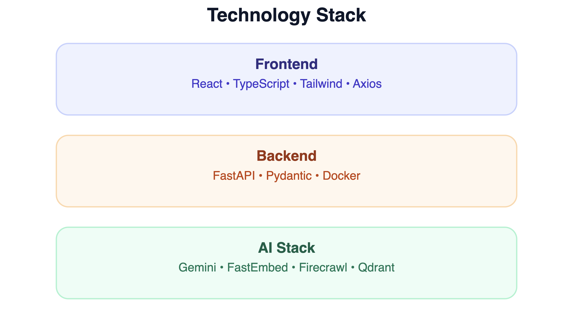

# 🤖 AI Documentation Assistant

**A Retrieval-Augmented Generation (RAG) app that turns any documentation site into a chatbot with cited, source-grounded answers.**

<p align="center">


</p>

## Overview

Point this app at a documentation URL and it crawls, chunks, embeds and indexes the content into Qdrant. Users ask natural-language questions and receive grounded answers with confidence scores and source citations.

---

## Demo

<table>
<tr>
<td><br><sub>Landing Page</sub></td>
<td><br><sub>AI Response</sub></td>
</tr>
<tr>
<td><br><sub>Swagger UI</sub></td>
<td><br><sub>Documentation Ingestion</sub></td>
</tr>
</table>

---

## Architecture

<p align="center">

</p>

### Request Lifecycle

<p align="center">

</p>

### Ingestion Pipeline

<p align="center">

</p>

---

## Tech Stack

<p align="center">

</p>

---

## Project Structure

<p align="center">

</p>

---

## Getting Started

```bash
git clone https://github.com/antrika02/ai-documentation-assistant.git
cd ai-documentation-assistant

python -m venv .venv
source .venv/bin/activate

pip install -r requirements.txt

uvicorn app.main:app --reload
```

Frontend:

```bash
cd frontend
npm install
npm run dev
```

---

## Roadmap

<p align="center">

</p>

- Voice interaction
- Streaming responses
- Conversational memory
- Hybrid retrieval
- Cloud deployment

---

## Author

**Antrika Kashyap**

GitHub: https://github.com/antrika02

LinkedIn: https://www.linkedin.com/in/antrika-kashyap-070502250/
