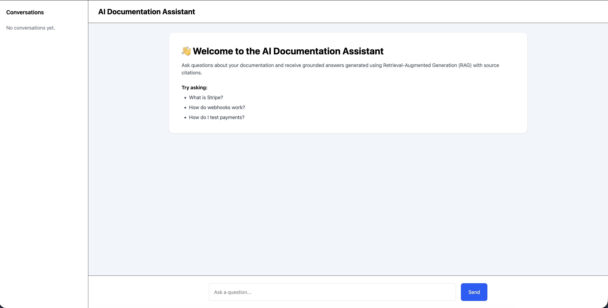
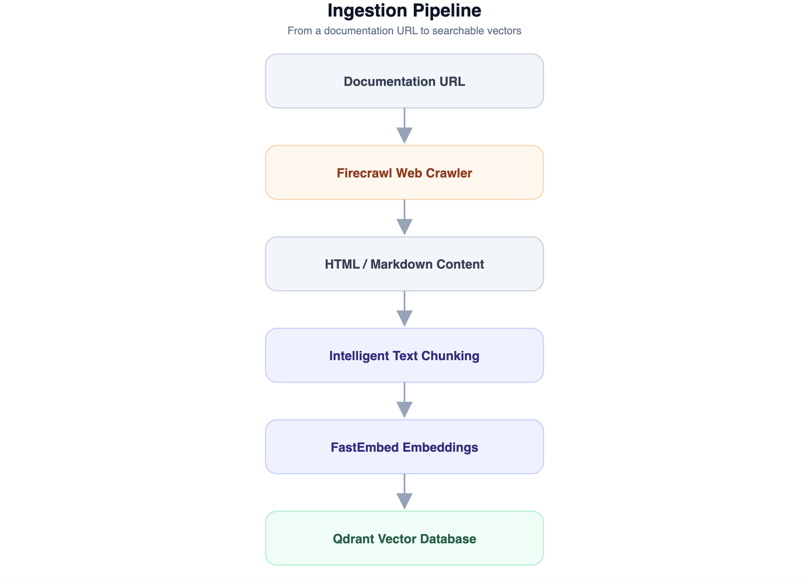
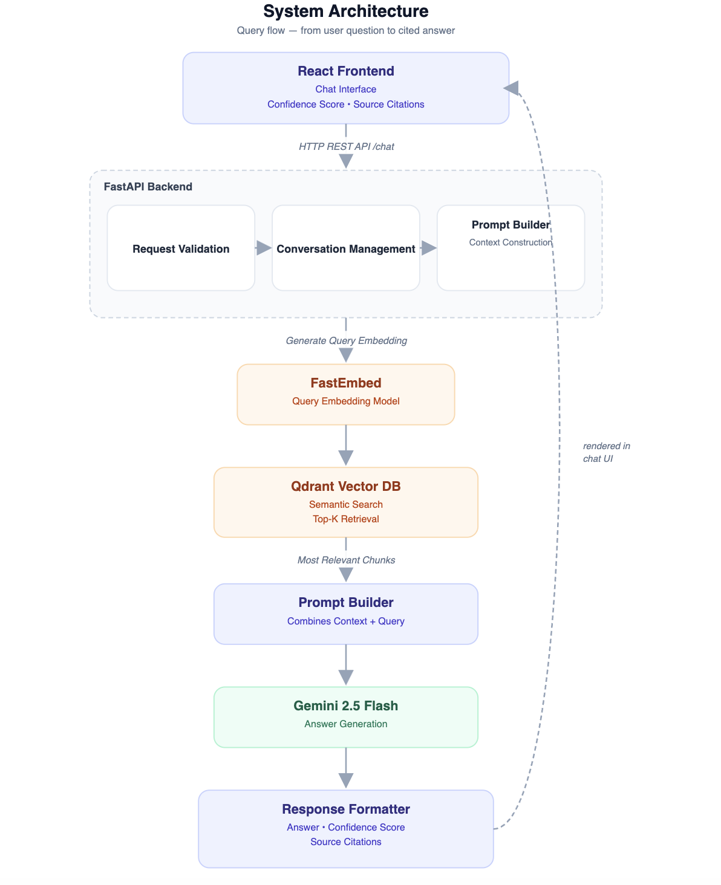
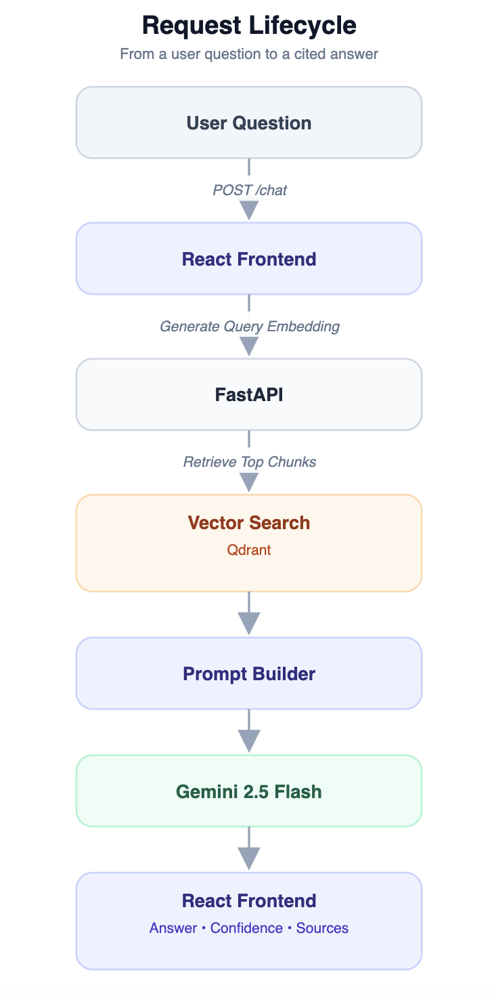
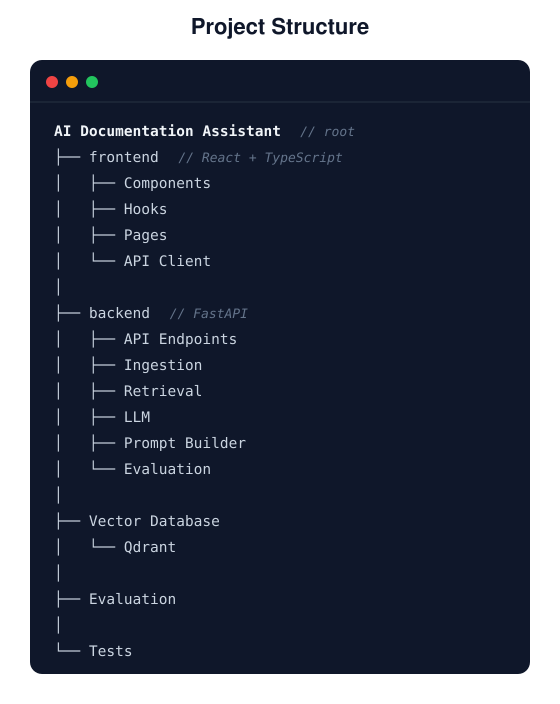
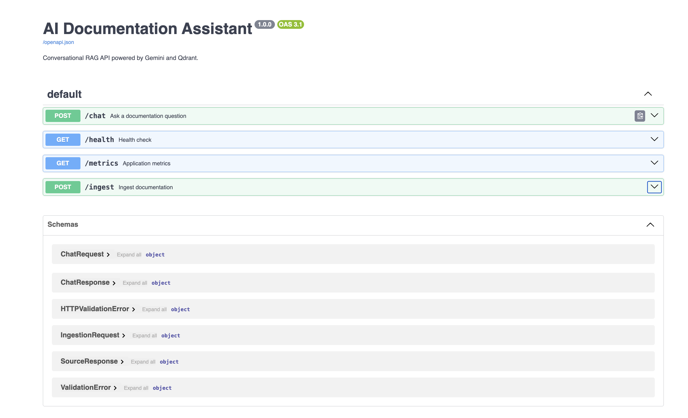
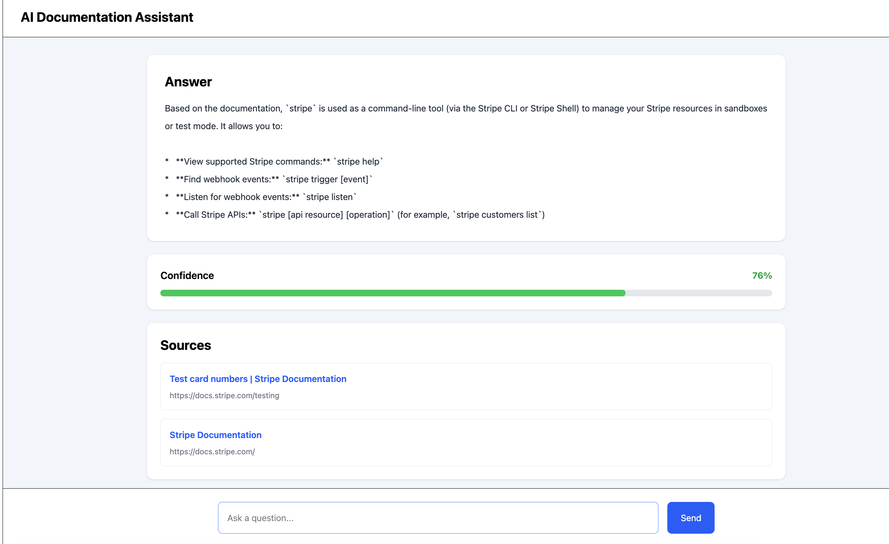
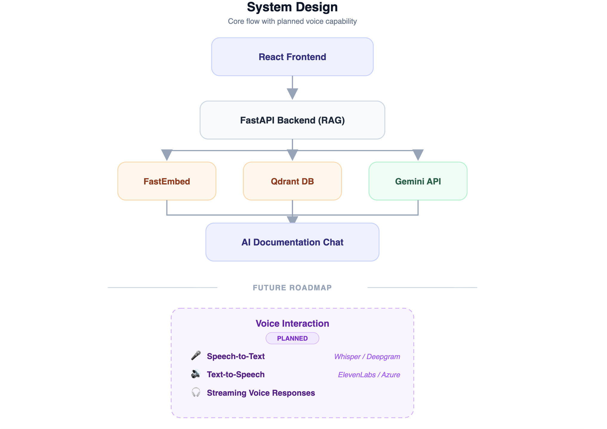

# 📚 AI Documentation Assistant

<p align="center">
  
</p>

<p align="center">
  A conversational <b>RAG (Retrieval-Augmented Generation)</b> assistant that turns any documentation site into a
  source-cited Q&amp;A system — built with <b>FastAPI</b>, <b>React + TypeScript</b>, <b>Qdrant</b>, <b>FastEmbed</b>,
  <b>Firecrawl</b>, and <b>Gemini 2.5 Flash</b>.
</p>

<p align="center">
  
  
  
  
  
  
</p>

<p align="center">
  
  
  
</p>

---

## ✨ At a Glance

- Turns any documentation URL into a searchable knowledge base via **Firecrawl → chunking → FastEmbed → Qdrant**
- Every answer ships with a **confidence score** and **clickable source citations** — no hallucinated links
- **React + TypeScript** chat interface with persistent conversation history
- **FastAPI** backend exposing `/chat`, `/ingest`, `/health`, and `/metrics`, fully documented via OpenAPI 3.1
- AI layer (embeddings, retrieval, prompt construction, generation) is isolated behind a dedicated service layer, independent of the request/response layer

---

## 📑 Table of Contents

1. [Project Overview](#-project-overview)
2. [Key Features](#-key-features)
3. [System Architecture](#️-system-architecture)
   - [Ingestion Pipeline](#ingestion-pipeline)
   - [Query Architecture](#query-architecture)
   - [Request Lifecycle](#request-lifecycle)
4. [Project Structure](#-project-structure)
5. [Technology Stack](#️-technology-stack)
6. [Getting Started](#-getting-started)
7. [API Documentation](#-api-documentation)
8. [Example Usage](#-example-usage)
9. [Roadmap](#-roadmap)
10. [Author](#-author)
11. [License](#-license)

---

## 📖 Project Overview

AI Documentation Assistant is a two-stage RAG application: an **ingestion pipeline** that crawls a documentation site and indexes it as searchable vectors, and a **query pipeline** that answers natural-language questions against that index with grounded, source-cited responses.

Rather than a simple "search bar with an LLM bolted on," the system is built around explicit stages — crawling, chunking, embedding, retrieval, prompt construction, and generation — each owned by its own component, so any single piece (the crawler, the embedding model, or the LLM) can be swapped without touching the rest of the pipeline.

---

## 🚀 Key Features

- **Source-grounded answers** — every response is generated only from retrieved documentation chunks, each with a confidence score and linked source
- **Conversational memory** — a sidebar tracks past conversations, and follow-up questions stay in context
- **Guided onboarding** — the landing screen suggests starter questions ("What is Stripe?", "How do webhooks work?") so new users know what to ask
- **Self-serve ingestion** — a `POST /ingest` endpoint lets any documentation URL be added to the knowledge base without a redeploy
- **Observability built in** — `/health` and `/metrics` endpoints for uptime and performance monitoring
- **Fully documented API** — interactive Swagger UI and ReDoc, generated automatically from the FastAPI schema

---

## 🏗️ System Architecture

### Ingestion Pipeline

From a raw documentation URL to searchable vectors:

<p align="center">
  
</p>

`Documentation URL` → **Firecrawl** (web crawler) → `HTML / Markdown Content` → **Intelligent Text Chunking** → **FastEmbed** (embeddings) → **Qdrant Vector Database**

### Query Architecture

From a user's question to a cited answer:

<p align="center">

  

</p>

The **React frontend** sends the question to `POST /chat`. Inside **FastAPI**, the request passes through validation and conversation management before reaching the **Prompt Builder**, which triggers a **FastEmbed** query embedding. That embedding is used to run a **top-K semantic search in Qdrant**, and the most relevant chunks flow back into the Prompt Builder, which combines context + query and sends it to **Gemini 2.5 Flash**. The **Response Formatter** packages the answer, confidence score, and source citations, which render directly in the chat UI.

### Request Lifecycle

<p align="center">
  
</p>

A sequence view of the same round trip: `React Frontend → FastAPI → Qdrant (vector search) → Gemini 2.5 Flash → React Frontend`, returned as **Answer • Confidence • Sources**.

---

## 📂 Project Structure

<p align="center">
  
</p>


---

## ⚙️ Technology Stack


| Layer | Technology |
|-------|------------|
| **Frontend** | React • TypeScript • Tailwind • Axios |
| **Backend** | FastAPI • Pydantic • Docker |
| **AI Stack** | Gemini • FastEmbed • Firecrawl • Qdrant |

---

## 🚀 Getting Started

> Adjust commands below to match your repo's exact scripts if they differ.

```bash
git clone https://github.com/antrika02/AI-Documentation-Assistant.git
cd AI-Documentation-Assistant
```

**Backend**
```bash
cd backend
pip install -r requirements.txt   # or: uv sync

cp .env.example .env
# GEMINI_API_KEY=your_google_gemini_api_key
# QDRANT_URL=your_qdrant_instance_url
# QDRANT_API_KEY=your_qdrant_api_key
# FIRECRAWL_API_KEY=your_firecrawl_api_key

uvicorn app.main:app --reload
```

**Frontend**
```bash
cd frontend
npm install
npm run dev
```

**Ingest your first documentation site**
```bash
curl -X POST http://127.0.0.1:8000/ingest \
  -H "Content-Type: application/json" \
  -d '{"url": "https://docs.stripe.com/"}'
```

---

## 🌐 API Documentation

<p align="center">
  
</p>

Interactive docs are auto-generated at `/docs` (Swagger UI) and `/redoc` (ReDoc).

| Method | Endpoint | Description |
|--------|----------|-------------|
| POST | `/chat` | Ask a documentation question |
| POST | `/ingest` | Ingest a new documentation source |
| GET | `/health` | Health check |
| GET | `/metrics` | Application metrics |

**Schemas:** `ChatRequest`, `ChatResponse`, `IngestionRequest`, `SourceResponse`, `HTTPValidationError`, `ValidationError`

---

## 💬 Example Usage

<p align="center">
  
</p>

```text
User: What is stripe used as?

Answer:
Based on the documentation, `stripe` is used as a command-line tool (via the
Stripe CLI or Stripe Shell) to manage your Stripe resources in sandboxes or
test mode:
  • View supported Stripe commands: `stripe help`
  • Find webhook events: `stripe trigger [event]`
  • Listen for webhook events: `stripe listen`
  • Call Stripe APIs: `stripe [api resource] [operation]`

Confidence: 76%

Sources:
  • Test card numbers | Stripe Documentation — https://docs.stripe.com/testing
  • Stripe Documentation — https://docs.stripe.com/
```

---

## 🗺 Roadmap

<p align="center">
  
</p>

<p align="center">
  
</p>

**🚧 Planned — Voice Interaction**

| Capability | Approach |
|------------|----------|
| 🎤 Speech-to-Text | Whisper / Deepgram |
| 🔊 Text-to-Speech | ElevenLabs / Azure |
| 🎧 Streaming voice responses | Real-time audio streaming layered on the existing RAG pipeline |

**🌱 Other future scope**
- Multi-source ingestion (PDFs, GitHub READMEs, Notion pages)
- Multi-turn re-ranking for longer conversations
- Auth & multi-tenant knowledge bases

---

## 👩‍💻 Author

**Antrika Kashyap**
Final-Year Computer Science Student · Backend Developer · AI Engineer

| Platform | Link |
|----------|------|
| GitHub | [github.com/antrika02](https://github.com/antrika02) |
| LinkedIn | [linkedin.com/in/antrika-kashyap-070502250](https://www.linkedin.com/in/antrika-kashyap-070502250) |
| Email | [antrikakashyap2@gmail.com](mailto:antrikakashyap2@gmail.com) |

---

## 📄 License

This project is licensed under the MIT License.

---

<p align="center">
  ⭐ If you found this project useful, consider giving it a Star ⭐
</p>
